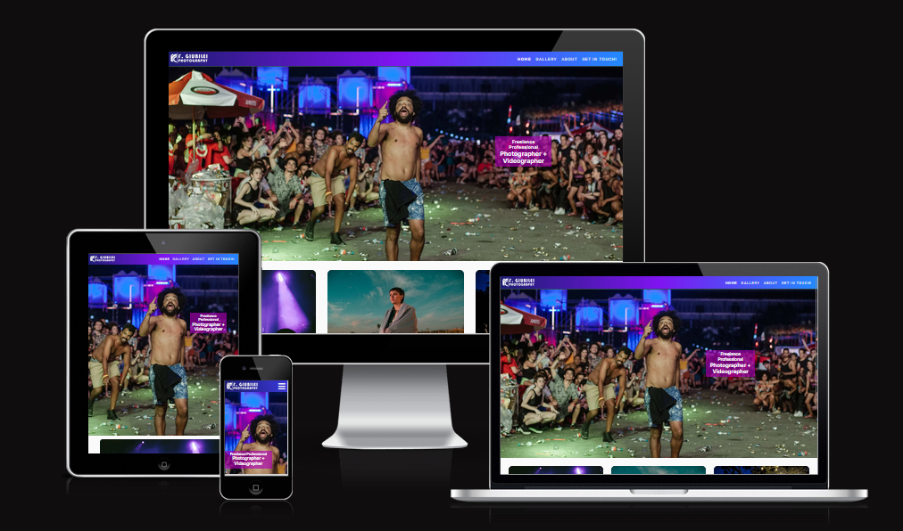
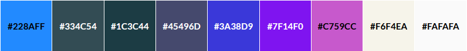
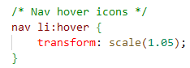
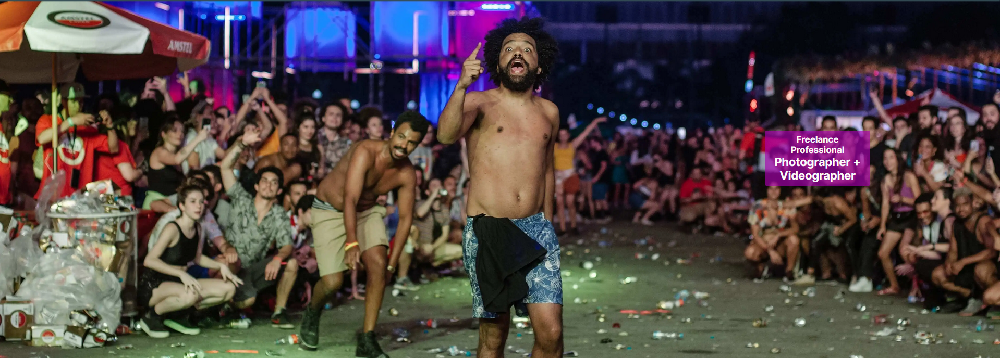
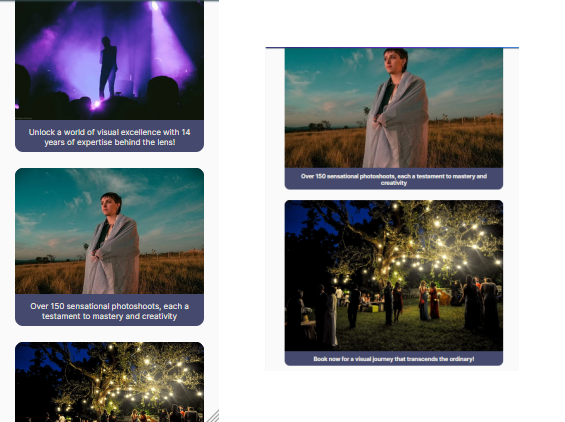

# Felipe Giubilei Photography



[Visit my website here](https://hpesciotti.github.io/FGiubilei/index.html)

<!-- <div align="center">


</div> -->

## CONTENTS  

1. [Introduction](#introduction)

2. [User Experience - UX](https://github.com/hpesciotti/FGiubilei/#ux-design)

    i. [Strategy Plane](https://github.com/hpesciotti/FGiubilei/#strategy-plane)

    ii. [User stories](https://github.com/hpesciotti/FGiubilei/#user-stories)
    
    iii. [Wireframes](https://github.com/hpesciotti/FGiubilei/#structure-plane)

    iv. [Design](https://github.com/hpesciotti/FGiubilei/#scope-plane)

3. [Features](https://github.com/hpesciotti/FGiubilei/#features)

    i. [Existing Features](https://github.com/hpesciotti/FGiubilei/#existing-features)

    ii. [Features to be implemented in the future](https://github.com/hpesciotti/FGiubilei/#features-to-be-implemented-in-the-future)

4. [Technology Used](https://github.com/hpesciotti/FGiubilei/#technology-used)

    i. [Languages Used](https://github.com/hpesciotti/FGiubilei/#main-languages)

    ii. [Frameworks, Libraries & Programs Used](https://github.com/hpesciotti/FGiubilei/#frameworks-libraries-and-programmes)

6. [Deployment](https://github.com/hpesciotti/FGiubilei/#deployment)

7. [Testing](https://github.com/hpesciotti/FGiubilei/#issues-and-bugs)

    i. [Testing User Stories from User Experience (UX) Section](https://github.com/hpesciotti/FGiubilei/#main-languages)

    ii. [Further Testing](https://github.com/hpesciotti/FGiubilei/#main-languages)

    iii. [Known Bugs](https://github.com/hpesciotti/FGiubilei/#main-languages)

8. [Credits](https://github.com/hpesciotti/FGiubilei/#credits)

9. [Acknowledgements](https://github.com/hpesciotti/FGiubilei/#acknowledgements)


## **1-Introduction**

Welcome to Felipe Giubilei Photography, the website of a Brazilian audiovisual professional with a diverse portfolio comprising a plethora of photoshoots, from family pictures and renowned rock bands to journalistic images of demonstrations and independent short films. The website is designed as an online portfolio showcasing Felipe's artistic creations and aims to attract potential clients who value a skilled and versatile photographer by displaying his work.  

On a personal note, in the search for the ideal theme to build my first website, part of PP1, I was still deciding the object of this task. Starting from an actual premise for my first project is more manageable than creating a fictional business. 

Therefore, I thought about the work of my dear cousin Felipe Giubilei, an accomplished photographer. To my surprise, his work needs a landing page. Thus, besides having a solid theme for my PP1 with excellent visual appeal given by his photos, I can soon grace him with a fully functional website.

[Back to top](https://github.com/hpesciotti/FGiubilei/?tab=readme-ov-file#felipe-giubilei-photography)

## **2-UX Design**

### **2.1-Strategy**

While researching other photographers' websites, I noticed they were very minimalistic in design, with few text sections and mainly focusing on the photos. The artistic appeal was high, but the page layout structure was sometimes unorthodox. Another thing I noticed is that, in general, there are two types of photographer websites: some more artistic, which belong to award-winning professionals, and the more user friendly ones, with more recognizable sections, sucha as contact details, which belong to freelance professionals specialized in wedding photoshoots. 

I intended to blend those styles, striking a balance between something artistic but also accessible and luring possible clients. I am also looking for a familiar design for the website, and I concluded that we usually connect with photography through Instagram or Flickr. Considering my coding limitations, I looked for design and layout trademarks from those companies to implement on my website.

Some of the photographer's pages I researched were selected by [Webcitz](https://www.webcitz.com/blog/50-best-photographer-websites/) as the best 50 photographers websites.

#### **Artistic Unorthodox Websites**
- [David William Baum](https://www.davidwilliambaum.com/)
- [Levon Biss](https://levonbiss.com/)
- [Giles Clement](https://www.gilesclement.com/)

#### **More User Friendly Websites**
- [Greg Ross](https://www.gregoryrossblog.com/)
- [Kristen Hazelton](https://kristenhazelton.com/)
- [WeShootFood](https://www.weshootfood.net/)

[Back to top](https://github.com/hpesciotti/FGiubilei/?tab=readme-ov-file#felipe-giubilei-photography)

### **2.2-User Stories**

#### **First Time Visitor Goals**
-   I want to acquaint myself with the photographer's portfolio.
-   I want to understand the types of photoshoots the photographer can undertake.
-   I want to quickly find what I'm looking for, without extensive reading or following numerous links.

#### **Returning Visitor Goals**
-   I want to learn about the photographer's qualifications.
-   I want to discover how to contact the photographer.
-   I want to easily find social media links.

#### **Frequent User Goals**
-   I want to book a session with the photographer.
-   I want to see new additions to the portfolio.

[Back to top](https://github.com/hpesciotti/FGiubilei/?tab=readme-ov-file#felipe-giubilei-photography)

### **2.3-Wireframes**

I created the initial website wireframes in MS PowerPoint, which I was most familiar with. At this stage in the project development, I hadn't decided on the colour scheme yet, so I experimented with the design and layout of the main pages/features.

#### **Desktop Version**
-   [Index](docs/documentation/wireframes-index-pc.png)
-   [Gallery](docs/documentation/wireframes-gallery-pc.png)
-   [About](docs/documentation/wireframes-about-pc.png)
-   [Contact](docs/documentation/wireframes-contact-pc.png)

#### **Mobile Version**
-   [Index](docs/documentation/wireframes-index-mobile.png)
-   [Gallery](docs/documentation/wireframes-gallery-mobile.png)
-   [About](docs/documentation/wireframes-about-mobile.png)
-   [Contact](docs/documentation/wireframes-contact-mobile.png)

[Back to top](https://github.com/hpesciotti/FGiubilei/?tab=readme-ov-file#felipe-giubilei-photography)

### **2.4-Design**

#### **Imagery**

I used authorial photos, so I had to select images from the photographer's portfolio. As selecting criteria, I wanted images to elucidate his capabilities and versatility. I ended up grouping the pictures into six types, which subsequently became the sections inside the gallery page, those are: 
-   Concerts,
-   Family Moments,
-   Solo Photoshoots,
-   Institutional Events,
-   Urban Photography, and,
-   Weddings.

#### **Colour Scheme**

The colour scheme is inspired by tones of violet, indigo, and spotlights, as seen in the selected pictures. This theme is currently popular in software development, and it can be seen in the Microsoft 365 icon, Microsoft Clipchamp and [ESRI Ireland's website](https://www.esri-ireland.ie/en-ie/homehttps://www.esri-ireland.ie/en-ie/home), which heavily weighted on the chosen appearance of my website's nav bar. The colour scheme also matches the background hues of the [hero-image](docs/documentation/hero-image.png).



The selection of text and background took into consideration the contrast ratio of at least Level AA. [EightShape contrast grid](docs/documentation/contrast-grid.png) is present in the documentation. 

#### **Typography**

I employed three different fonts for the website design. The logo features the Bauhaus 93 font, which is not included in the style.css file as it was utilized in another software to create the logo image. The other two fonts, Inter and Rubik, are sourced from Google Fonts. Rubik font is applied to the navigation bar, while Inter is used in the rest of the website's sections, such as textual elements.

[Back to top](https://github.com/hpesciotti/FGiubilei/?tab=readme-ov-file#felipe-giubilei-photography)

## **3-Features**

### **3.1-Existing Features**

### **Index/Home Page**

#### **Navigation Bar**


- The navigation bar features links that allow users to scroll smoothly to any main page sections.

- The mobile version substitutes the links for a toggle menu indicated by stacked bars. The link area is available through a dropdown menu. 
I accomplished this design based on the Love Running Project.


- A hover effect [transform scale](https://www.w3schools.com/cssref/css3_pr_transform.php) was added on the link anchors for the desktop version. This feature was suggested by a friend, Bruno Dias. I was using a transform font-size effect in early iterations.



- The navigation bar's background has a degradé effect that changes from a three-colour gradient on the desktop/tablet version to a two-colour gradient on the mobile version. This choice was simply made by aesthetics. I drew inspiration from a degradé background from [ESRI Ireland's website](https://www.esri-ireland.ie/en-ie/homehttps://www.esri-ireland.ie/en-ie/home). The background css querry was obtainded through [CSS Gradient's website](https://cssgradient.io/).

[Back to top](https://github.com/hpesciotti/FGiubilei/?tab=readme-ov-file#felipe-giubilei-photography)

#### **Hero Section**



- The Hero Section of my website occupies the full width of the screen and is located at the top of the index page. I intended to capture the visitor's attention with a captivating picture that would also match the website's colour scheme. 

- The Hero Section is responsive and maintains the shirtless man dancing at the centre of the page in all size versions of the website. 


- This feature wasn't planned when the wireframes were created, but the spacing and lack of an eye-catching element drove me to add the current Hero Section. I took inspiration for this feature from the Love Running Project.

- There's also a "call to action" box that quickly informs the user of the website's main goal. This element was a source of a couple of errors due to its responsivity. The box was bleeding the Hero Section on smaller screens, which prompted me to change the hero image to a relative measure. In this case, I've used "em" unit for the length of the hero image.

[Back to top](https://github.com/hpesciotti/FGiubilei/?tab=readme-ov-file#felipe-giubilei-photography)

#### **Polaroid Section**


- The Polaroid section was designed when drawing up the wireframes. This element provides the user with information about the photographer's capabilities and professional background, as well as where he's based, via image and text. 

- The [Coders' Guidebook website](https://codersguidebook.com/how-to-build-a-website/how-to-add-polaroid-images-to-a-website) inspired this section. 

- In the mobile version, the Polaroid boxes stack up, taking up a large part of the device's width. The tablet version, depending on the screen's width, resembles either the desktop version or the mobile version.



- I added box-shadow and hover transform scale on large screens for better user interactivity.

[Back to top](https://github.com/hpesciotti/FGiubilei/?tab=readme-ov-file#felipe-giubilei-photography)

## **4-Technologies Used**

### **4.1-Languages Used**
- [HTML5](https://en.wikipedia.org/wiki/HTML5)
- [CSS3](https://en.wikipedia.org/wiki/Cascading_Style_Sheets)

### **4.2 - Frameworks, Libraries, Technologies & Programs Used**  
- Gitpod: used form coding
- GitHub: to save and store all files for this website  
- Git: used for version control
- Google Fonts: fonts were imported from here 
- Font Awesome: icons and their associated kit were downloaded from here  
- MS Power Point: used to create wireframes
- ArcGIS: used to create site logo 
- Favicon.io: for ice cream favicon  
- Tiny PNG: to compress images
- JPG to WEBP | CloudConvert: to convert jpg to webp and further compressing
- ChatGPT:  for improving and making text content more engaging
- Grammarly: fo spelling or grammatical inaccuracies in the text
- Google Dev Tools: to debug and for testing responsiveness 
- Google Lighthouse: for auditing the performance of the website
- W3C Validator: for validating the HTML and CSS code 

[Back to top](https://github.com/hpesciotti/FGiubilei/?tab=readme-ov-file#felipe-giubilei-photography)

## **5-Testing**

### **5.1-Futher Testing**

### **5.2-Bugs & Fixes** 

### **5.3-Unsolved Bugs** 

[Back to top](https://github.com/hpesciotti/FGiubilei/?tab=readme-ov-file#felipe-giubilei-photography)

## **6-Deployment**

The website was developed using Gitpod code editor, committed to Git as a local repository, and then pushed to GitHub for storage.

### **6.1-GitHub Pages**

The project was deployed to GitHub Pages using the following steps:

I. Log in to GitHub.
II. Navigate to the main page of GitHub Repository that will be deployed.
III. At the top of the Repository, find the "Settings" button on the menu and click on it.
IV. Inside the settings, on the left side of the page, there’s a list of tab menu. Find the “Pages” tab, and click on it.
V. Under "Source", click on the dropdown item called "None", select "Master", and then click on the “Save” button.
VI. The page will automatically refresh.
VII. Now you should see a notification message that provides the now published site link: “Your site is ready to be published at [https://hpesciotti.github.io/FGiubilei/](https://hpesciotti.github.io/FGiubilei/)”.

### **6.1-Forking the GitHub Repository**

By forking the GitHub repository you can make a copy of the original repository on your GitHub account. You can view and/or make changes to this copy, without affecting the original repository, by using the following steps:

I. Log in to GitHub.
II. Navigate to the main page of the GitHub Repository that you want to fork.
III. At the top right of the Repository, just below your profile picture, find the "Fork" button.
IV. You should now have a copy of the original repository in your GitHub account.
V. Changes made to the forked repository can be merged with the original repository via a pull request.

### **6.2-Making a Local Clone**

By cloning a GitHub Repository, you can create a local copy on your computer of the remote repository. This allows you to make all of your edits locally, rather than directly in the source files of the origin repository, by using the following steps:

I. Log in to GitHub
II. Navigate to the main page of the GitHub Repository that you want to clone.
III. Above the list of files, click on the dropdown item called "Code".
IV. To clone the repository using HTTPS, copy the link under "HTTPS".
V. Open Git Bash.
VI. Change the current working directory to the location where you want the cloned directory to be made.
VII. Type `git clone`, and then paste the URL you copied in Step 4.

```
$ git clone https://github.com/YOUR-USERNAME/YOUR-REPOSITORY
```

VIII. Finally, press Enter. Your local clone has now been created.

```
$ git clone https://github.com/YOUR-USERNAME/YOUR-REPOSITORY
> Cloning into `CI-Clone`...
> remote: Counting objects: 10, done.
> remote: Compressing objects: 100% (8/8), done.
> remove: Total 10 (delta 1), reused 10 (delta 1)
> Unpacking objects: 100% (10/10), done.
```

Changes made on the local machine (cloned repository) can be pushed to the upstream repository directly if you have a write access for the repository. Otherwise, the changes made in the cloned repository are first pushed to the forked repository, and then a pull request is created.

[Click Here](https://docs.github.com/en/github/creating-cloning-and-archiving-repositories/cloning-a-repository-from-github/cloning-a-repository) for a more comprehensive guide on how to complete the above process.

[Back to top](https://github.com/hpesciotti/FGiubilei/?tab=readme-ov-file#felipe-giubilei-photography)

## **7-Credits**

### **7.1-Content**

- [W3Schools](https://www.w3schools.com/howto/howto_js_scroll_to_top.asp): for hover transform scale and font-size effect and flex-box rules.

- [Code Institute](https://codeinstitute.net/ie/): Love Running Project, various implemented contents, such as: hero section, gallery, footer, and form section.

- [CSS Gradient's website](https://cssgradient.io/): for the gradient/degradé effect on the nav bar.

- [Coders' Guidebook website](https://codersguidebook.com/how-to-build-a-website/how-to-add-polaroid-images-to-a-website): for the porlaroid section.

- [ESRI Ireland's website](https://www.esri-ireland.ie/en-ie/homehttps://www.esri-ireland.ie/en-ie/home): influencedn on the chosen appearance of my website's nav bar.

- [Shane Doyle/spacefruit](https://github.com/ShaneDoyleDev/spacefruit): for README structure and Markdown guidance.

- [Alice Hillier/rainforest-cafe](https://github.com/alicehillier/rainforest-cafe): for README structure and Markdown guidance.

- [Amy Richardson/scoops](https://amylour.github.io/scoops_pp1): for README structure and Markdown guidance.

### **7.2-Media**

- All the images used in the website were kindly provided by [Felipe Giubilei](https://www.flickr.com/photos/felipegfotografia/page9)

- [Font Awesome](https://fontawesome.com/): for the icons used in the footer of this site.

- [Favicon](https://favicon.io/): for the favicon used for this site.

### **7.3-Acknowlegements**

- My cousin, [Felipe Giubilei](https://www.instagram.com/felipegiubilei/), for provinding his beatiful pictures.

- My mentor, [Darío Carrasquel](https://github.com/jeetkunecoder/jeetkunecoder), for his support and constructive feedback.

- My informal mentor and great friend, [Bruno Dias](https://github.com/brunoald/brunoald), for his helpful and supportive advice.

- My cohort facilitator, [Amy Richardson](https://github.com/amylour/amylour), for being always helpful and testing the website. 

- My partner, Joana, and my sister, Patrícia, for testing the website.

[Back to top](https://github.com/hpesciotti/FGiubilei/?tab=readme-ov-file#felipe-giubilei-photography)


